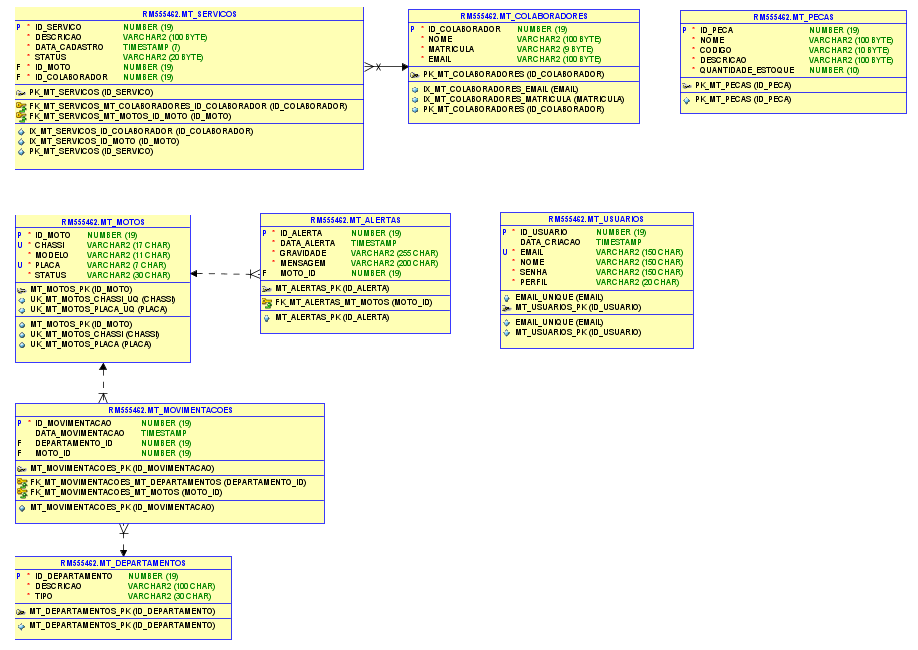

# 🏍️ MotoTrack - Backend API REST (Java)

## 👥 Integrantes

- **Felipe Ulson Sora** – RM555462 – [@felipesora](https://github.com/felipesora)
- **Augusto Lope Lyra** – RM558209 – [@lopeslyra10](https://github.com/lopeslyra10)
- **Vinicius Ribeiro Nery Costa** – RM559165 – [@ViniciusRibeiroNery](https://github.com/ViniciusRibeiroNery)

## 📌 Sumário

- [📝 Descrição da Solução](#-descrição-da-solução)  
- [🗄️ Modelagem do Banco de Dados](#️-modelagem-do-banco-de-dados)  
- [🚀 Como Rodar o Projeto MotoTrack Completo](#-como-rodar-o-projeto-mototrack-completo)  
- [⚙️ Detalhes do Projeto REST API (Java)](#️-detalhes-do-projeto-rest-api-java)  
- [🚀 Como Rodar o Projeto API REST (Java)](#-como-rodar-o-projeto-api-rest-java)  
- [📹 Demonstração em Vídeo](#-demonstração-em-vídeo)  

## 📝 Descrição da Solução

O **MotoTrack** é um sistema completo desenvolvido para auxiliar empresas de aluguel de motos, como a Mottu, no **controle e monitoramento de sua frota**. 
A aplicação foi criada para resolver problemas comuns de gestão, como a desorganização nos pátios, dificuldade em localizar motos disponíveis ou em manutenção, 
e a falta de histórico rastreável de movimentações e serviços.

O sistema também oferece funcionalidades para **gerenciamento de serviços e manutenções**, vinculando cada atividade a um **colaborador responsável**
, além de permitir o **controle de estoque de peças**, garantindo reposição eficiente e visibilidade dos recursos da empresa.

### O sistema permite:
- 📝 **Cadastro e gestão de motos**;
- 🏢 **Organização por departamentos**, facilitando a localização de veículos;
- 🔄 **Controle de movimentações**, com histórico detalhado;
- 🛠️ **Gestão de serviços e manutenções**, vinculando responsáveis por cada atividade;
- 👨‍🔧 **Registro de colaboradores** envolvidos nos serviços;
- 📦 **Controle de estoque de peças**;
- 🚨 **Disparo de alertas** para acompanhamento do status das motos.

### Estrutura da Solução
O projeto foi dividido em múltiplos módulos para facilitar **escalabilidade e integração**, cada um com responsabilidades específicas:  

- ⚙️ **Backend REST em Java (Spring Boot)** – gerencia as entidades de **usuário, moto, movimentações e alertas**, utilizando **Spring Security com JWT** para autenticação e autorização.  
- 🖥️ **Backend MVC em Java (Spring MVC)** – oferece as mesmas entidades do backend REST Java, com um **frontend web bonito e funcional**, permitindo cadastro, edição, listagem e exclusão de dados diretamente pelo navegador. Possui **Spring Security** com validação de tipo de usuário (**Administrador** e **Comum**) para controlar o acesso às funcionalidades.
- 🧩 **Backend REST em .NET (ASP.NET Core)** – gerencia as entidades de **moto (somente leitura das tabelas criadas pelo Java), colaboradores, serviços e peças**, integrando funcionalidades complementares ao sistema.  
- 📱 **Frontend Mobile (React Native/Expo)** – consome ambas as APIs (Java e .NET) e disponibiliza **telas de cadastro, edição, exclusão e visualização** das funcionalidades, incluindo serviços, colaboradores e estoque de peças.  
- 🗄️ **Banco de Dados Oracle** – utilizado por todos os backends, com **criação automática de tabelas** ao iniciar os projetos.  

---

## 🗄️ Modelagem do Banco de Dados
Abaixo está a modelagem das tabelas utilizadas pelo sistema:  



---

## 🚀 Como Rodar o Projeto MotoTrack Completo

Para utilizar o **MotoTrack** de forma completa, é necessário rodar simultaneamente três módulos:

1. **⚙️ Backend API REST em Java (Spring Boot)** – fornece os endpoints REST para o sistema.
2. **🧩 Backend API REST em .NET (ASP.NET Core)** – fornece funcionalidades complementares via API.
3. **📱 Frontend Mobile (React Native/Expo)** – aplicação mobile que consome ambas as APIs e exibe todas as funcionalidades, incluindo serviços, colaboradores e estoque de peças.
>O **Backend MVC em Java (Spring MVC)** pode ser executado separadamente. Ele permite:
> - **📝 Login e cadastro de usuários;**
> - **🏍️ Cadastro, listagem, edição e exclusão de motos;**
> - **🔄 Cadastro, listagem e exclusão de movimentações e alertas.**

### 🛠️ Passo a Passo

1. Clone todos os repositórios:  
   - [API Rest Java](https://github.com/mototrack-challenge/mototrack-backend-rest-java)  
   - [API Rest .NET](https://github.com/mototrack-challenge/mototrack-backend-rest-dotnet)  
   - [Mobile](https://github.com/mototrack-challenge/mototrack-frontend-mobile)  
   - [MVC Java](https://github.com/mototrack-challenge/mototrack-backend-mvc-java)

2. 🔌 Configure as credenciais de conexão com o banco Oracle nos arquivos de configuração dos backends, se necessário.
    - ✅ O banco de dados e as tabelas serão **criados automaticamente** ao iniciar os backends (Java REST, Java MVC e .NET)

3. 🚀 Rode os backends
    - Java REST: `mvn spring-boot:run` ou rode pelo IDE favorito 
    - .NET REST: `dotnet run` ou abra no Visual Studio

4. 📱 Rode o frontend mobile:
    - Navegue até a pasta do projeto e execute `npm install` para instalar dependências  
    - Execute `npx expo start` para abrir o app no emulador ou dispositivo físico

> ⚠️ Dica: primeiro inicie os backends para que o mobile consiga se conectar às APIs corretamente

5. 🖥️ Para testar o **MVC Java**, basta executar o projeto normalmente; ele funciona isoladamente, sem depender dos outros módulos

---

## ⚙️ Detalhes do Projeto REST API (Java)

O **MotoTrack REST API Java** é o módulo backend desenvolvido com **Spring Boot**, responsável por disponibilizar serviços REST para o gerenciamento da frota de motos, usuários, movimentações, alertas e departamentos.  
Ele funciona como **camada principal de regras de negócio e persistência de dados**, sendo consumido pelo **Frontend Mobile** e podendo ser integrado com outros módulos da solução.

### 🛠️ Tecnologias e Dependências
O projeto utiliza as seguintes tecnologias e bibliotecas principais:  
- **Java 21**  
- **Spring Boot** – desenvolvimento da API REST  
- **Spring Data JPA** – integração com o **Oracle Database**  
- **Spring Security + JWT (JSON Web Token)** – autenticação e autorização via token
- **Flyway** – versionamento e migração automática do banco de dados 
- **Maven** – gerenciamento de dependências e build do projeto

### 🔑 Autenticação com JWT
Para acessar as rotas protegidas da API, é necessário realizar autenticação:  
1. Enviar uma requisição **POST** para: [http://localhost:8080/auth/login](http://localhost:8080/auth/login)
Com o corpo:  
```json
{
  "email": "admin@email.com",
  "senha": "admin123"
}
```

2. A resposta retornará um **token JWT**.

3. Esse token deve ser utilizado em todas as próximas requisições no header:
```bash
Authorization: Bearer {seu_token_aqui}
```

> ⚠️ **Observação**: a rota **POST - /usuarios** é **pública** e pode ser usada para cadastrar novos usuários **sem necessidade de token**. Todas as demais rotas de CRUD e acesso ao sistema exigem autenticação via JWT.


### 📝 Funcionalidades
A API permite realizar operações de **criação, leitura, atualização e exclusão** para as seguintes entidades:
- 🏍️ **Motos**
- 👤 **Usuários**
- 🔄 **Movimentações**
- 🚨 **Alertas**
- 🏢 **Departamentos**

### 🌐 Exemplos de Endpoints

#### 🔐 Usuário

- `POST - /usuarios`  
  Cadastra um novo usuário.

```jsonc
{
  "nome": "Felipe",
  "email": "felipe@email.com",
  "senha": "felipe123",
  "perfil": "ADMIN"
}
```

- `GET - /usuarios`  
  Lista todas os usuários cadastrados.

- `GET BY ID - /usuarios/{id}`  
  Lista o usuário cadastrado com este id.

- `PUT - /usuarios/{id}`  
  Atualiza os dados do usuário com este id.

```jsonc
{
  "nome": "Felipe Sora", // alterando nome
  "email": "felipe@email.com",
  "senha": "felipe123",
  "perfil": "COMUM" // alterando perfil
}
```

- `DELETE - /usuarios/{id}`  
  Remove o usuário com este id.

#### 🛵 Moto

- `POST - /motos`  
  Cadastra uma nova moto.

```jsonc
{
  "placa": "GHI9015",
  "chassi": "7723JC4198VR1G74B",
  "modelo": "MOTTU_E",
  "status": "AVALIACAO"
}
```

- `GET - /motos`  
  Lista todas as motos cadastradas.

- `GET BY ID - /motos/{id}`  
  Lista a moto cadastrada com este id.

- `PUT - /motos/{id}`  
  Atualiza os dados da motos com este id.

```jsonc
{
  "placa": "GHI9015",
  "chassi": "7723JC4198VR1G74B",
  "modelo": "MOTTU_POP", // alterando modelo
  "status": "DISPONIVEL" // alterando status
}
```

- `DELETE - /motos/{id}`  
  Remove a moto com este id.

#### 🔁 Movimentação

- `POST - /movimentacoes`  
  Cadastra uma nova movimentação.

```jsonc
{
  "moto_id": 1,
  "departamento_id": 2
}
```

- `GET - /movimentacoes`  
  Lista todas as movimentações cadastradas.

- `GET BY ID - /movimentacoes/{id}`  
  Lista a movimentação cadastrada com este id.

- `PUT - /movimentacoes/{id}`  
  Atualiza os dados da movimentação com este id.

```jsonc
{
  "moto_id": 1,
  "departamento_id": 3 // alterando departamento
}
```

- `DELETE - /movimentacoes/{id}`  
  Remove a movimentação com este id.

#### 🏬 Departamento

- `POST - /departamentos`  
  Cadastra um novo departamento.

```jsonc
{
  "tipo_departamento": "AVALIACAO",
  "descricao": "Departamento de Avaliação"
}
```

- `GET - /departamentos`  
  Lista todos os departamentos cadastrados.

- `GET BY ID - /departamentos/{id}`  
  Lista o departamento com este id.

- `PUT - /departamentos/{id}`  
  Atualiza os dados do departamento com este id.

```jsonc
{
  "tipo_departamento": "MANUTENCAO", // alterando tipo do departamento
  "descricao": "Departamento de Manutenção" // alterando descrição do departamento
}
```

- `DELETE - /departamentos/{id}`  
  Remove o departamentos com este id.

#### 🚨 Alerta

- `POST - /alertas`  
  Cadastra um novo alerta.

```jsonc
{
  "gravidade": "ALTA",
  "mensagem": "Pneu dianteiro precisa ser substituído",
  "moto_id": 1
}
```

- `GET - /alertas`  
  Lista todos os alertas cadastrados.

- `GET BY ID - /alertas/{id}`  
  Lista o alerta com este id.

- `PUT - /alertas/{id}`  
  Atualiza os dados do alerta com este id.

```jsonc
{
  "gravidade": "MEDIA", // alterando gravidade do alerta
  "mensagem": "Pneu dianteiro precisa ser substituído",
  "moto_id": 1
}
```

- `DELETE - /alertas/{id}`  
  Remove o alerta com este id.

--- 

## 🚀 Como Rodar o Projeto API REST (Java)

Para executar o **MotoTrack MVC Java**, siga os passos abaixo:

### 1️⃣ Configurar o Banco de Dados
- Abra o arquivo de configuração do banco (por exemplo, `application.properties`) e configure as **credenciais de acesso ao Oracle** (usuário, senha e URL).

### 2️⃣ Verificar Dependências
- Certifique-se de que o **Maven carregou todas as dependências** corretamente.  
- No IntelliJ IDEA, o Maven fará o download automático ao abrir o projeto, mas é recomendado verificar na aba **Maven** se todas as dependências foram resolvidas.

### 3️⃣ Executar o Projeto
- Abra o projeto no **IntelliJ IDEA**.  
- Clique no **ícone de play** na classe principal (`@SpringBootApplication`) para iniciar o servidor.  
- O projeto será iniciado no **localhost:8080**.

### 4️⃣ Acessar a Aplicação
- Abra o navegador e acesse: [http://localhost:8080](http://localhost:8080)

> ⚠️ Dica: Primeiro configure o banco e verifique as dependências do Maven para evitar erros de inicialização.